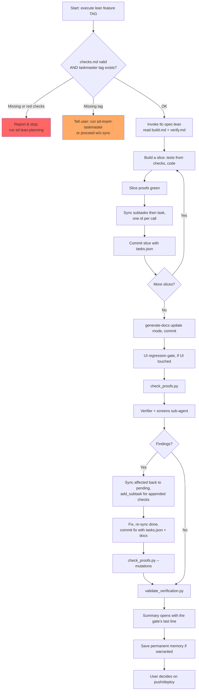

# Execution Flow Diagram

```mermaid
flowchart TD
    A[Start: execute lean feature TAG] --> B{checks.md valid<br/>AND taskmaster tag exists?}
    B -->|Missing or red checks| Z1[Report & stop:<br/>run sd-lean-planning]
    B -->|Missing tag| Z2[Tell user: run sd-insert-taskmaster<br/>or proceed w/o sync]
    B -->|OK| C[Invoke tlc-spec-lean<br/>read build.md + verify.md]
    C --> D[Build a slice: tests from checks, code]
    D --> E[Slice proofs green]
    E --> F[Sync subtasks then task,<br/>one id per call]
    F --> G[Commit slice with tasks.json]
    G --> H{More slices?}
    H -->|Yes| D
    H -->|No| I[generate-docs update mode, commit]
    I --> J[UI regression gate, if UI touched]
    J --> K[check_proofs.py]
    K --> L[Verifier + screens sub-agent]
    L --> M{Findings?}
    M -->|Yes| N[Sync affected back to pending,<br/>add_subtask for appended checks]
    N --> O[Fix, re-sync done,<br/>commit fix with tasks.json + docs]
    O --> P[check_proofs.py --mutations]
    P --> Q
    M -->|No| Q[validate_verification.py]
    Q --> R[Summary opens with the gate's last line]
    R --> S[Save permanent memory if warranted]
    S --> T[User decides on push/deploy]

    style Z1 fill:#f66
    style Z2 fill:#fa6
```

Taskmaster mirrors progress; tlc-spec-lean's Build, proofs and Verifier drive execution. All sync and docs commits land before the last `check_proofs.py`.
