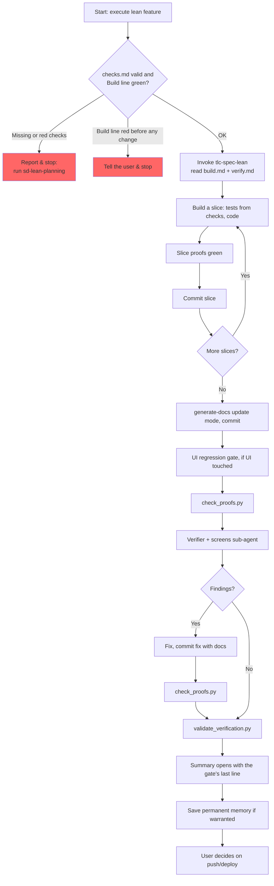

# Execution Flow Diagram

```mermaid
flowchart TD
    A[Start: execute lean feature] --> B{checks.md valid and<br/>Build line green?}
    B -->|Missing or red checks| Z1[Report & stop:<br/>run sd-lean-planning]
    B -->|Build line red before any change| Z2[Tell the user & stop]
    B -->|OK| C[Invoke tlc-spec-lean<br/>read build.md + verify.md]
    C --> D[Build a slice: tests from checks, code]
    D --> E[Slice proofs green]
    E --> G[Commit slice]
    G --> H{More slices?}
    H -->|Yes| D
    H -->|No| I[generate-docs update mode, commit]
    I --> J[UI regression gate, if UI touched]
    J --> K[check_proofs.py]
    K --> L[Verifier + screens sub-agent]
    L --> M{Findings?}
    M -->|Yes| O[Fix, commit fix with docs]
    O --> P[check_proofs.py]
    P --> Q
    M -->|No| Q[validate_verification.py]
    Q --> R[Summary opens with the gate's last line]
    R --> S[Save permanent memory if warranted]
    S --> T[User decides on push/deploy]

    style Z1 fill:#f66
    style Z2 fill:#f66
```

tlc-spec-lean's Build, proofs and Verifier drive execution. All docs commits land before the last `check_proofs.py`.
